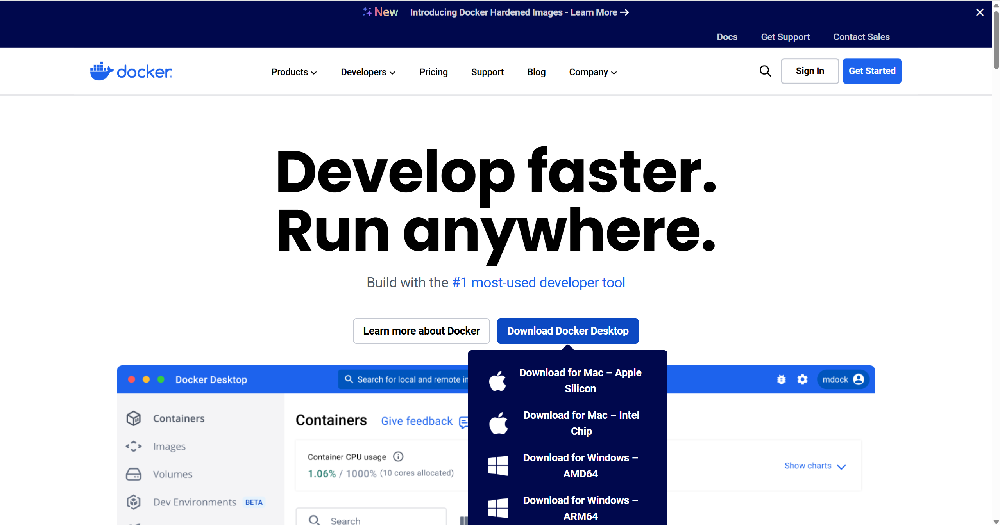

# Docker快速入門

## 使用Docker的目的
對整個項目進行封裝，並上載到DockerHub等倉庫中，然後在其他設備上只要將鏡像下載下來，便能輕易運行並部署，這樣做的好處便是避免了使用者出現環境兼容問題，而且大大節省了重新部署的時間。

## 安裝Docker
前往[docker官網](https://www.docker.com/)進行下載安裝



## Docker概念
#### 容器 Container => 一個被封裝好的項目

#### 卷 Volume => 一個獨立儲存數據的地方，即使掛載的容器被刪除，卷將仍然存在

#### 網絡 Network => 可以想像成一個局域網，其可以容納多個容器，並其用域名、port等資源

## 創建並運行你的第一個docker容器
### 創建並運行名為my_docker的容器container
* 需要注意要運行docker前 需要先開啟Docker Desktop 這樣才能夠開啟服務
```
# -d 表示後台運行
# --name 表示容器的名稱
# -p 表示映射的路由 前面的80是docker里面的路由 映射到 瀏覽器的路由
# nginx:alpine 表示基于alpine用dockerfile創建的nginx鏡像 可以把它理解為設置web server

docker run -d --name my_docker -p 80:80 nginx:alpine
```
前往 [127.0.0.1:80](127.0.0.1:80) 可查看服務是否已啟動

### 查看容器
查看正在運行的容器
```
docker ps
```

查看所有的容器(包括沒有運行的容器)
```
docker ps -a
```

### 刪除容器
停止正在運行的容器
```
docker stop my_docker
```

刪除容器
```
docker rm my_docker
```

## 創建鏡像
* 需要注意要創建鏡像，那麼項目中便需要存在DockerFile

### 文件佈局
整個檔案文件夾

|-- 項目文件

|-- DockerFile(執行程序)

|-- requirements.txt(執行環境需要的包)

### 創建鏡像my_docker
```

```

### 排錯流程
```
# 1. 查看requirements.txt的內容在docker中是否正常
type requirements.txt

# 2. 清理鏡像構建緩存
docker builder prune

# 3. 構建鏡像 --no-cache用以無視緩存
docker build --no-cache -t mnist-api .

```

### 刪除鏡像
```
docker rmi 
```
